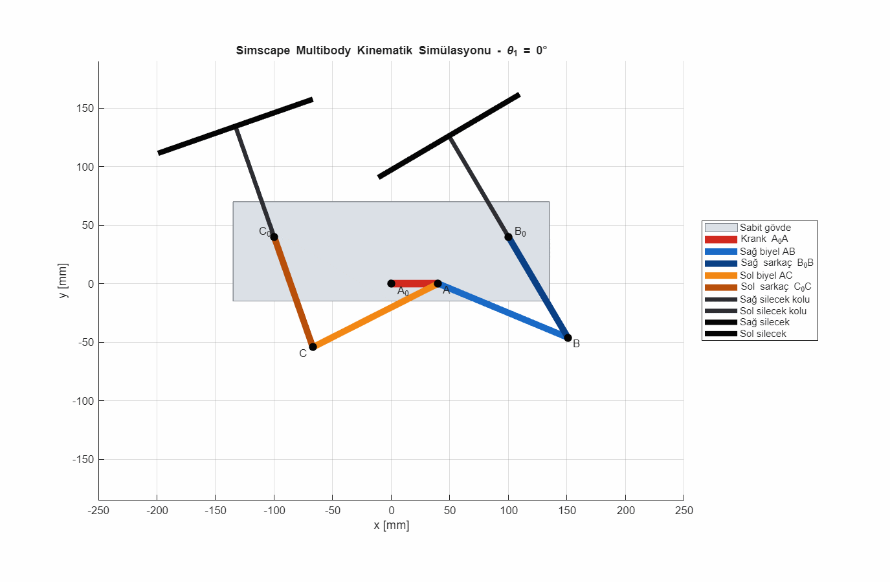
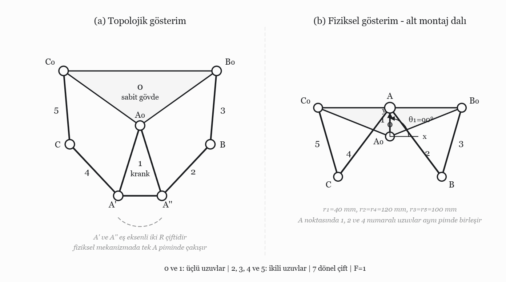
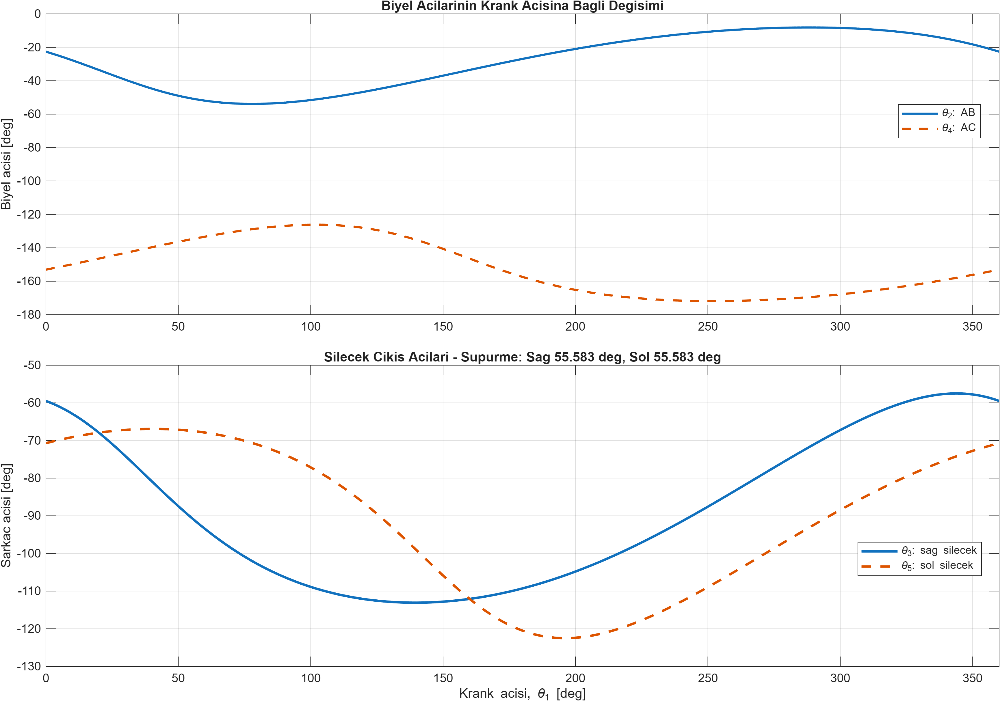
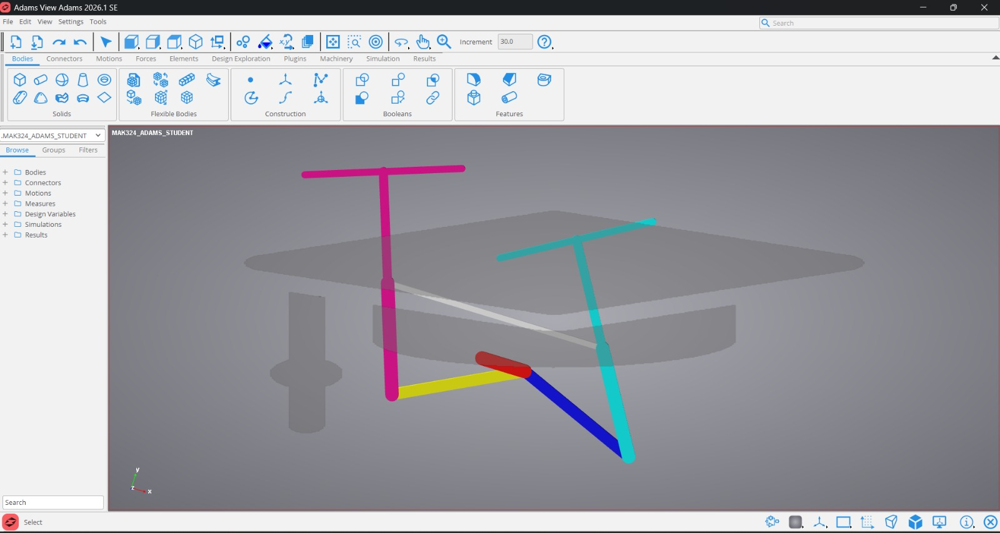
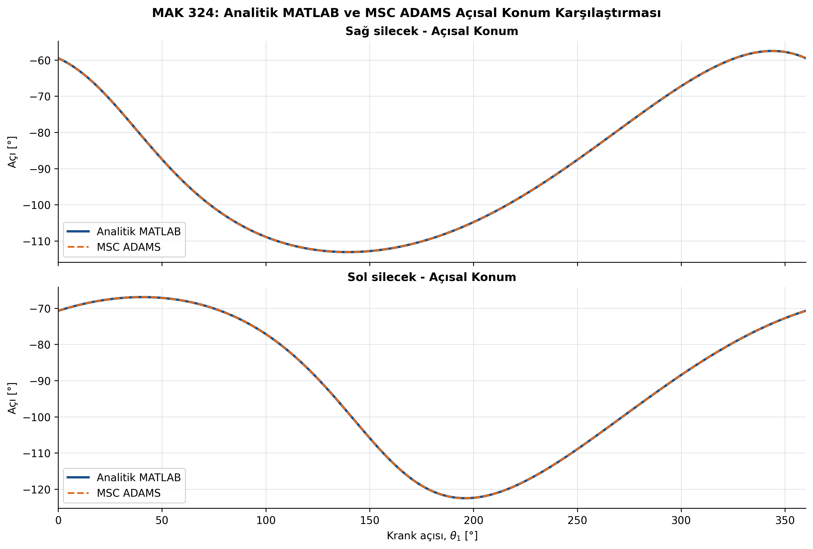
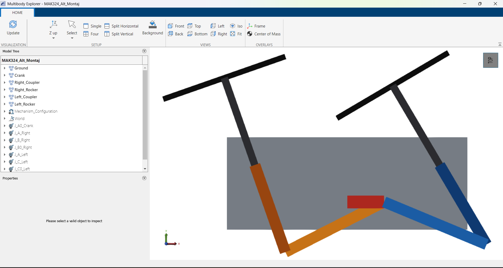
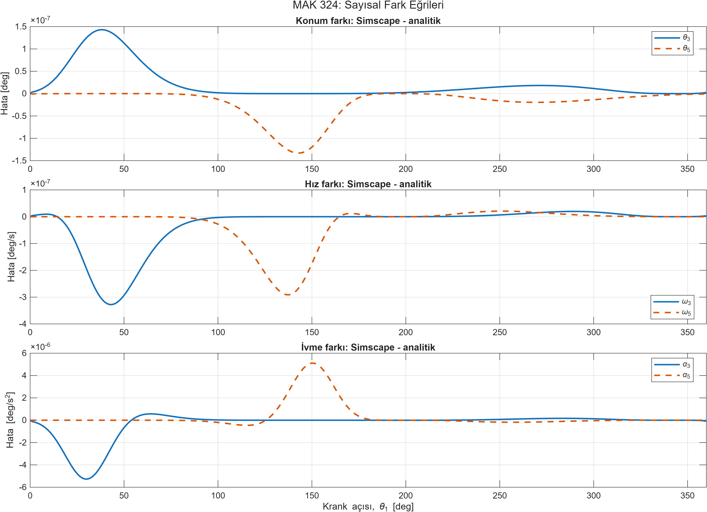

# Symmetric Double Four-Bar Wiper Mechanism — Analytical & CAE Kinematic Analysis

**MATLAB · MSC Adams · Simscape Multibody**

Analytical and computer-aided kinematic analysis of a windshield wiper linkage in which a single central crank drives the left and right wiper arms simultaneously through a symmetric double four-bar arrangement. The closed-loop equations are derived by hand, solved numerically in MATLAB, and validated against two independent multibody models: **MSC Adams** and **Simscape Multibody**.

Individual term project for **MAK 324 – Theory of Machines**, Istanbul Technical University (Summer 2026).

<p align="center">
  
</p>

## Highlights

- **Topology:** Watt II six-bar (6 links, 7 revolute joints) with mobility **F = 1**; both four-bar loops are **Grashof crank-rockers**.
- **Analytical model:** loop-closure position, velocity and acceleration equations in a shared Jacobian form, solved in MATLAB (Newton–Raphson for position with assembly-branch tracking; direct linear solves for velocity and acceleration).
- **Result:** both wipers sweep **55.5831°**, with a phase difference between the left and right arms.
- **MSC Adams validation:** maximum absolute differences of **5.60×10⁻⁵ °** (position), **1.30×10⁻⁴ °/s** (velocity) and **1.53×10⁻³ °/s²** (acceleration).
- **Simscape Multibody cross-check:** an independently built model reproduces the analytical results at the **10⁻⁷–10⁻⁶** level.

## Problem Definition

| Fixed points | (x, y) [mm] | | Link | Length [mm] |
|---|---|---|---|---|
| A₀ | (0, 0) | | Crank A₀A | 40 |
| B₀ | (100, 40) | | Couplers AB = AC | 120 |
| C₀ | (−100, 40) | | Rockers B₀B = C₀C | 100 |

The right loop is A₀–A–B–B₀ and the left loop is A₀–A–C–C₀; both share the crank. The crank is driven at a constant 60 rpm (ω₁ = 2π rad/s, α₁ = 0).

<p align="center">
  
</p>

## Method

### 1. Kinematic chain, mobility and Grashof check

Links 1, 2 and 4 meet at the same physical pin A, so this joint is counted as two coaxial revolute pairs. The mechanism therefore has 6 links and 7 revolute pairs. The ground (0) and the crank (1) are adjacent ternary links, which defines a Watt chain; fixing a ternary link gives the **Watt II** inversion. Functionally, it works as a symmetric double crank-rocker driven by a common crank.

Gruebler–Kutzbach mobility:

$$F = 3(n-1) - 2e_1 - e_2 = 3(6-1) - 2\cdot 7 - 0 = 1$$

Grashof check for the right loop (the left loop is identical by symmetry), with ground length |A₀B₀| = 107.70 mm:

$$S + L = 40 + 120 = 160 \quad < \quad P + Q = 100 + 107.70 = 207.70$$

The shortest link is the crank, adjacent to the ground, so each loop is a **crank-rocker**: the crank makes full revolutions while the rockers oscillate. Because the inequality is strict, there is no change-point ambiguity.

### 2. Loop-closure equations

With the unit vector $\mathbf{e}(\theta) = [\cos\theta, \sin\theta]^T$ and the secondary coordinates $\mathbf{q} = [\theta_2, \theta_3, \theta_4, \theta_5]^T$:

$$r_1\mathbf{e}(\theta_1) + r_2\mathbf{e}(\theta_2) - r_3\mathbf{e}(\theta_3) - \mathbf{r}_{B_0} = \mathbf{0}$$

$$r_1\mathbf{e}(\theta_1) + r_4\mathbf{e}(\theta_4) - r_5\mathbf{e}(\theta_5) - \mathbf{r}_{C_0} = \mathbf{0}$$

These four scalar constraints form $\mathbf{\Phi}(\mathbf{q}, \theta_1) = \mathbf{0}$ with the Jacobian $\mathbf{J} = \partial\mathbf{\Phi}/\partial\mathbf{q}$.

### 3. Numerical solution

The crank angle θ₁ is swept from 0° to 360° in 0.5° steps. At each step:

| Analysis | Linear system | Notes |
|---|---|---|
| Position | $\mathbf{J}\Delta\mathbf{q} = -\mathbf{\Phi}$ | Newton–Raphson (residual tolerance 10⁻¹¹, at most 30 iterations); the previous solution is the initial guess, which keeps the lower assembly branch over the whole revolution |
| Velocity | $\mathbf{J}\dot{\mathbf{q}} = -\mathbf{\Phi}_{\theta_1}\omega_1$ | Same Jacobian |
| Acceleration | $\mathbf{J}\ddot{\mathbf{q}} = \mathbf{b}$ | Same Jacobian; **b** holds the centripetal and α₁ terms |

The inverse of **J** is never formed explicitly; the linear systems are solved with MATLAB's backslash operator.

## Code

### `MAK324_C_Kinematik_Analiz.m` — analytical solver (base MATLAB, no toolboxes)

| Component | Analytical counterpart | Role |
|---|---|---|
| `constraintVector` | Φ(q, θ₁) | Evaluates the four loop-closure constraints |
| `constraintJacobian` | J = ∂Φ/∂q | Builds the Jacobian shared by position, velocity and acceleration |
| `solvePositionNewton` | J Δq = −Φ | Newton–Raphson position solution on the lower assembly branch |
| `velocityRHS` (in the main loop) | −Φ<sub>θ₁</sub> ω₁ | Right-hand side of the velocity system |
| `accelerationRHS` | b | Builds J q̈ = b with the centripetal and α₁ terms |
| `drawMechanism` | — | Draws the linkage for the animation |

### `MAK324_D_Simscape_Calistir.m` — Simscape Multibody model and comparison

Builds the linkage programmatically (`buildWiperMechanism`), saves it as the Simulink model `MAK324_D_Simscape_Model.slx`, sweeps the crank from 0° to 360° in 1° steps (`runKinematicSweep`), compares the results with the analytical CSV (`compareWithAnalytical`), and writes the summary, plots and animation. Positions and velocities come from `computeState` at each crank angle, using the previous rocker angles as low-priority targets to stay on the lower branch; accelerations come from `computeDynamics` with a computed motor torque and zero crank acceleration.

## How to Run

Set `matlab-simscape/` as MATLAB's current folder.

**Part C — analytical solution** (any recent MATLAB, no toolboxes):

```matlab
MAK324_C_Kinematik_Analiz
```

Writes `MAK324_C_Sayisal_Sonuclar.csv`, `MAK324_C_Ozet.txt`, the position/velocity/acceleration plots and the animation `MAK324_C_Mekanizma.gif` to the current folder.

**Part D — Simscape Multibody** (MATLAB R2025a with Simulink, Simscape and Simscape Multibody):

```matlab
MAK324_D_Simscape_Calistir("model")   % build the 3D model and open it in Multibody Explorer
MAK324_D_Simscape_Calistir("all")     % full sweep, comparison with Part C, plots and GIF
```

Outputs go to `MAK324_D_Ciktilar/`. The comparison needs `MAK324_C_Sayisal_Sonuclar.csv` in the same folder as the script; if it is missing, the comparison step is skipped. If `MAK324_D_Simscape_Model.slx` already exists, the script reopens it instead of rebuilding it.

## Results (60 rpm input, lower assembly branch)

| Quantity | Right wiper (θ₃) | Left wiper (θ₅) |
|---|---|---|
| Min. angular position | −113.0800° | −122.5030° |
| Max. angular position | −57.4970° | −66.9200° |
| **Sweep angle** | **55.5831°** | **55.5831°** |
| Min. angular velocity | −243.8319 °/s | −243.8319 °/s |
| Max. angular velocity | 150.9950 °/s | 150.9950 °/s |
| Min. angular acceleration | −2236.9744 °/s² | −1172.3779 °/s² |
| Max. angular acceleration | 1172.3779 °/s² | 2236.9744 °/s² |

Both wipers have the same sweep amplitude but reach their extremes at different crank angles: the right wiper reaches its minimum near θ₁ = 139.5° and its maximum near θ₁ = 344.0°, while the left wiper does so near θ₁ = 196.0° and θ₁ = 40.5°.

<p align="center">
  
</p>

More: [velocities](matlab-simscape/MAK324_D_Ciktilar/MAK324_C_Hiz.png), [accelerations](matlab-simscape/MAK324_D_Ciktilar/MAK324_C_Ivme.png), [MATLAB animation](matlab-simscape/MAK324_D_Ciktilar/MAK324_C_Mekanizma.gif), [full results table](matlab-simscape/MAK324_C_Sayisal_Sonuclar.csv).

## Validation 1 — MSC Adams

The linkage was modeled in **MSC Adams Student 2026.1** with 5 moving rigid bodies (crank, two couplers, two rockers) and 7 equivalent revolute joints; the triple pin at A is represented by two coaxial revolute joints. The input motion is θ₁(t) = 360t degrees (60 rpm, α₁ = 0), solved over 0–1 s at 361 output points (1° crank steps) on the lower assembly branch, with θ₃(0) = −59.4898° and θ₅(0) = −70.7116°.

The raw Adams exports are in [`adams/`](adams): `MEA_THETA3/5`, `MEA_OMEGA3/5` and `MEA_ALPHA3/5` (time vs. rocker angle, angular velocity and angular acceleration), together with the original Adams PostProcessor plots.

These exports were compared with the analytical solution at the same 1° crank nodes, with no phase shift, scaling or filtering:

| Maximum absolute difference | Right output | Left output | Unit |
|---|---|---|---|
| Position | 5.4358×10⁻⁵ | 5.5935×10⁻⁵ | ° |
| Velocity | 9.7390×10⁻⁵ | 1.2905×10⁻⁴ | °/s |
| Acceleration | 1.3112×10⁻³ | 1.5287×10⁻³ | °/s² |
| Sweep, Adams (1°) | 55.582530 | 55.582530 | ° |
| Sweep, analytical (1°) | 55.582556 | 55.582556 | ° |

The small saw-tooth-shaped differences come from the six-significant-digit rounding of the Adams text output and the solver tolerances; they do not indicate a physical mismatch between the models.

<p align="center">
  
</p>
<p align="center">
  
</p>

More: [velocity comparison](figures/matlab_vs_adams_velocity.png), [acceleration comparison](figures/matlab_vs_adams_acceleration.png).

## Validation 2 — Simscape Multibody

As a second, independent check with a different modeling and constraint-solving framework, the same geometry was built programmatically in **MATLAB R2025a Update 1 / Simscape Multibody 25.1** (zero gravity, pure kinematic comparison, 0–360° sweep in 1° steps).

| Maximum absolute difference | Right output | Left output | Unit |
|---|---|---|---|
| Position | 1.430365×10⁻⁷ | 1.331268×10⁻⁷ | ° |
| Velocity | 3.278508×10⁻⁷ | 2.913231×10⁻⁷ | °/s |
| Acceleration | 5.274017×10⁻⁶ | 5.109878×10⁻⁶ | °/s² |

These differences reflect double-precision arithmetic, solver convergence tolerances and internal coordinate and unit conversions, and are effectively zero at engineering scale. The animation at the top of this page (61 frames, 6° crank steps) comes from this model.

<p align="center">
  
</p>
<p align="center">
  
</p>

More: [position](matlab-simscape/MAK324_D_Ciktilar/MAK324_D_Karsilastirma_Konum.png), [velocity](matlab-simscape/MAK324_D_Ciktilar/MAK324_D_Karsilastirma_Hiz.png) and [acceleration](matlab-simscape/MAK324_D_Ciktilar/MAK324_D_Karsilastirma_Ivme.png) comparisons, [Simulink block model](figures/simscape_block_model.png), [comparison table](matlab-simscape/MAK324_D_Ciktilar/MAK324_D_Analitik_Simscape_Karsilastirma.csv), [summary](matlab-simscape/MAK324_D_Ciktilar/MAK324_D_Ozet.txt).

> **Note:** File names, plot labels and code comments are in Turkish, e.g. *sağ/sol silecek* = right/left wiper, *biyel* = coupler, *krank açısı* = crank angle, *konum/hız/ivme* = position/velocity/acceleration, *karşılaştırma* = comparison, *hata* = error, *çıktılar* = outputs, *özet* = summary.

## Repository Structure

```
├── matlab-simscape/
│   ├── MAK324_C_Kinematik_Analiz.m          # Part C: analytical solver
│   ├── MAK324_D_Simscape_Calistir.m         # Part D: Simscape Multibody model and comparison
│   ├── MAK324_D_Simscape_Model.slx          # Simulink model generated by the Part D script
│   ├── MAK324_C_Sayisal_Sonuclar.csv        # analytical results (0.5° steps), read by Part D
│   └── MAK324_D_Ciktilar/                   # outputs: plots, CSVs, summaries, animations
├── adams/                                   # MSC Adams Student 2026.1 exports and plots
├── figures/                                 # additional figures from the project report
├── LICENSE
└── README.md
```

## Software

MATLAB R2025a Update 1, Simulink, Simscape, Simscape Multibody 25.1, MSC Adams Student 2026.1.

## Selected References

1. Norton, R. L. *Design of Machinery*. McGraw-Hill.
2. Uicker, J. J.; Pennock, G. R.; Shigley, J. E. *Theory of Machines and Mechanisms*. Oxford University Press.
3. Söylemez, E. *Mekanizma Tekniği*. Birsen Yayınevi.
4. Erdman, A.; Titus, J.; Ibrahim, M. S.; Mather, S. (2026). A General Procedure for Basic Kinematic Chain Formation and Topology Selection for Planar Mechanisms. *Designs*, 10(3), 46. https://doi.org/10.3390/designs10030046
5. Simionescu, P. A.; Smith, M. R. (2000). Applications of Watt II Function Generator Cognates. *Mechanism and Machine Theory*, 35(11), 1535–1549. https://doi.org/10.1016/S0094-114X(00)00011-2
6. MathWorks. Simscape Multibody documentation. https://www.mathworks.com/help/sm/

## Course

MAK 324 – Theory of Machines, Istanbul Technical University, Summer 2026<br>
Instructor: Assist. Prof. Dr. Akif Yavuz

## Author

**Saliha Yıldız** · [LinkedIn](https://www.linkedin.com/in/yildizsaliha) · [GitHub](https://github.com/yildizs20)

## License

Released under the [MIT License](LICENSE).
